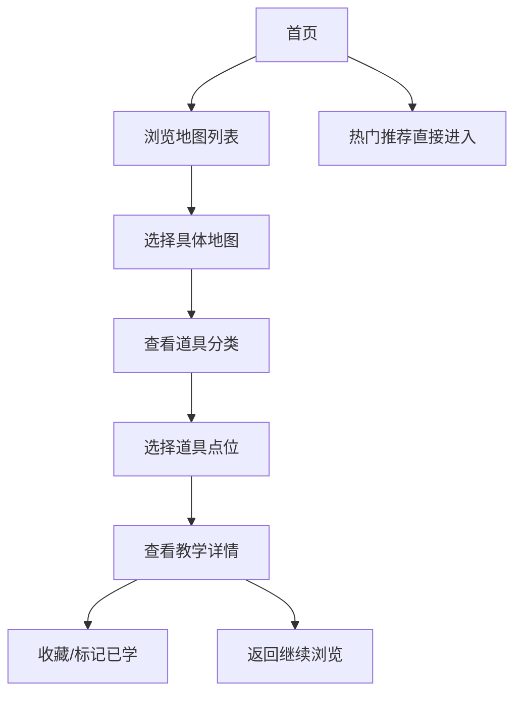

# CS2 道具教学网站 - 产品需求文档

## 1. 产品概述

一个专注于CS2（Counter-Strike 2）游戏道具（投掷物）教学的专业网站，帮助玩家学习精确的道具摆放点、投掷技巧和战术应用。

- **核心目的**：解决新手玩家道具使用困难的问题，提供直观的道具教学内容和交互式学习体验
- **目标用户**：CS2新手到中级玩家，尤其是想要提升游戏战术水平的玩家
- **产品价值**：提供免费、高质量的道具教学资源，帮助玩家快速成长

## 2. 核心功能

### 2.1 功能模块

1. **首页 (Home)**
   - 震撼的Hero展示区，带有动态背景效果
   - 地图快速导航入口
   - 热门道具教学推荐
   - 最新教学视频/文章列表

2. **地图列表页 (Maps)**
   - 所有支持地图的网格展示
   - 地图缩略图和难度标签
   - 快速筛选功能（按热度、难度、道具类型）

3. **地图详情页 (Map Detail)**
   - 地图俯视图展示
   - 道具分类导航（燃烧弹、闪光弹、烟雾弹、手雷）
   - 道具点位列表展示
   - 每个点位的详细教学面板

4. **道具教学详情页 (Tactic Detail)**
   - 道具类型标识
   - 投掷点位图示（静态图片 + 交互式标注）
   - 投掷步骤说明
   - 视频演示（可选嵌入YouTube/B站）
   - 适用场景和战术建议

5. **收藏/学习进度 (Favorites)**
   - 用户收藏的道具点位
   - 学习进度追踪
   - 标记已学会/待练习

## 3. 核心流程

### 3.1 用户浏览流程

```
首页 → 选择地图 → 查看该地图所有道具点位 → 点击点位查看详情 → 收藏或标记已学
```

### 3.2 流程图



## 4. 用户界面设计

### 4.1 设计风格

**主题：战术暗夜 (Tactical Dark)**
- 深邃的暗色背景配合霓虹强调色，呈现专业电竞氛围
- 参考CS2游戏UI的科技感和战术感

**配色方案：**
- 主色调：深灰黑 `#0a0a0f`
- 次要色：中灰 `#1a1a24`
- 强调色：CS2标志性霓虹青 `#00d4ff` + 警示橙 `#ff6b35`
- 文字色：白色 `#ffffff` + 灰 `#8a8a9a`
- 边框/分割：`#2a2a3a`

**字体选择：**
- 标题字体：`Orbitron` (科技感、几何感) 或 `Rajdhani` (军械感)
- 正文字体：`Inter` 或 `Roboto Mono` (代码感、战术感)
- Fallback：`system-ui, sans-serif`

**按钮风格：**
- 尖锐的直角边框，配合霓虹发光效果
- Hover时产生光晕扩散效果
- 关键按钮带脉冲动画

**布局风格：**
- 桌面端：左侧固定导航 + 右侧内容区
- 卡片式信息展示
- 大图配小字的视觉层次

**图标风格：**
- 使用线性图标
- 配合hover时的颜色变换

### 4.2 页面设计详情

#### 首页 (Home)
| 模块 | 样式 | 动画 |
|------|------|------|
| Hero区 | 全屏高度，动态粒子背景，中心大标题 | 文字逐字出现，背景缓慢移动 |
| 地图快捷入口 | 2x3网格，每格带地图缩略图和名称 | Hover放大 + 边框发光 |
| 热门推荐 | 横向滚动卡片列表 | 滚动渐入效果 |

#### 地图列表页 (Maps)
| 模块 | 样式 | 动画 |
|------|------|------|
| 页面标题 | 左对齐，带下划线装饰 | 加载时滑入 |
| 地图卡片 | 16:9缩略图 + 地图名称 + 难度标签 | Hover时上浮 + 阴影加深 |

#### 道具教学详情页 (Tactic Detail)
| 模块 | 样式 | 动画 |
|------|------|------|
| 道具标识 | 顶部标签栏，不同道具不同颜色 | 无 |
| 地图示意图 | 大尺寸，带可点击热点标注 | 点击热点弹出详情 |
| 步骤说明 | 数字编号 + 图文并排 | 依次滑入 |

### 4.3 响应式设计

- **桌面端优先** (1200px+)
- **平板适配** (768px-1199px)：导航折叠为侧边栏，网格调整为2列
- **移动端适配** (320px-767px)：底部Tab导航，网格单列，全屏卡片

## 5. 技术约束

- 使用React 18 + Vite构建
- 使用CSS Modules或Tailwind CSS进行样式管理
- 图片使用WebP格式，优化加载速度
- 支持PWA，可离线缓存已收藏内容（未来扩展）
