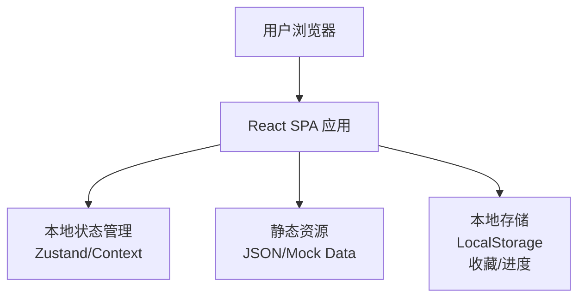

# CS2 道具教学网站 - 技术架构文档

## 1. 架构设计



**架构说明：**
- 前端单页应用 (SPA)，无后端服务
- 所有数据使用Mock JSON文件模拟
- 使用LocalStorage存储用户收藏和学习进度

## 2. 技术选型

| 类别 | 技术 | 版本 |
|------|------|------|
| 框架 | React | 18.x |
| 构建工具 | Vite | 5.x |
| 路由 | React Router DOM | 6.x |
| 状态管理 | React Context | 内置 |
| 样式 | Tailwind CSS | 3.x |
| 图标 | Lucide React | 最新 |
| 动画 | Framer Motion | 11.x |

## 3. 路由定义

| 路由 | 页面 | 功能描述 |
|------|------|----------|
| `/` | HomePage | 首页，展示Hero和热门内容 |
| `/maps` | MapsPage | 地图列表页 |
| `/maps/:mapId` | MapDetailPage | 单个地图的道具点位列表 |
| `/tactic/:tacticId` | TacticDetailPage | 道具教学详情 |
| `/favorites` | FavoritesPage | 用户收藏的道具 |

## 4. 数据结构

### 4.1 地图数据 (Map)
```typescript
interface Map {
  id: string;
  name: string;
  nameCn: string;
  thumbnail: string;
  difficulty: '入门' | '进阶' | '高级';
  tacticCount: number;
}
```

### 4.2 道具数据 (Tactic)
```typescript
interface Tactic {
  id: string;
  mapId: string;
  type: '燃烧弹' | '闪光弹' | '烟雾弹' | '手雷';
  name: string;
  description: string;
  steps: string[];
  image: string;
  videoUrl?: string;
  difficulty: '入门' | '进阶' | '高级';
  tags: string[];
}
```

### 4.3 用户数据 (UserData)
```typescript
interface UserData {
  favorites: string[]; // tacticIds
  learned: string[]; // tacticIds
}
```

## 5. 文件结构

```
cs2-tactic-site/
├── public/
│   └── images/
│       ├── maps/
│       └── tactics/
├── src/
│   ├── components/
│   │   ├── Layout/
│   │   ├── Navbar/
│   │   ├── MapCard/
│   │   ├── TacticCard/
│   │   └── ...
│   ├── pages/
│   │   ├── HomePage/
│   │   ├── MapsPage/
│   │   ├── MapDetailPage/
│   │   ├── TacticDetailPage/
│   │   └── FavoritesPage/
│   ├── data/
│   │   ├── maps.json
│   │   └── tactics.json
│   ├── context/
│   │   └── UserContext.tsx
│   ├── hooks/
│   ├── styles/
│   │   └── index.css
│   ├── App.tsx
│   └── main.tsx
├── index.html
├── package.json
├── vite.config.ts
└── tailwind.config.js
```

## 6. 组件设计

### 核心组件

| 组件 | 描述 | 复用位置 |
|------|------|----------|
| `Navbar` | 顶部导航栏，含Logo和菜单 | 全局 |
| `MapCard` | 地图卡片，展示缩略图和信息 | MapsPage, HomePage |
| `TacticCard` | 道具卡片，展示道具类型和名称 | MapDetailPage, FavoritesPage |
| `TypeTag` | 道具类型标签，不同类型不同颜色 | TacticCard, TacticDetail |
| `DifficultyBadge` | 难度徽章 | MapCard, TacticCard |
| `ImageWithHotspots` | 带热点的图片组件 | TacticDetailPage |
| `StepList` | 步骤列表展示 | TacticDetailPage |

## 7. 状态管理

使用 React Context 管理全局状态：

```typescript
interface UserContextType {
  favorites: string[];
  learned: string[];
  toggleFavorite: (tacticId: string) => void;
  markAsLearned: (tacticId: string) => void;
}
```

数据持久化到 LocalStorage。

## 8. Mock数据规划

### 初始地图数据
- Dust2 (炙热沙城2)
- Mirage (荒漠迷城)
- Inferno (炼狱小镇)
- Nuke (核子危机)
- Overpass (死亡游乐园)
- Ancient (远古遗迹)
- Anubis (阿尼乌斯)

### 初始道具数据
每个地图至少5个道具教学点位，覆盖不同类型和难度
